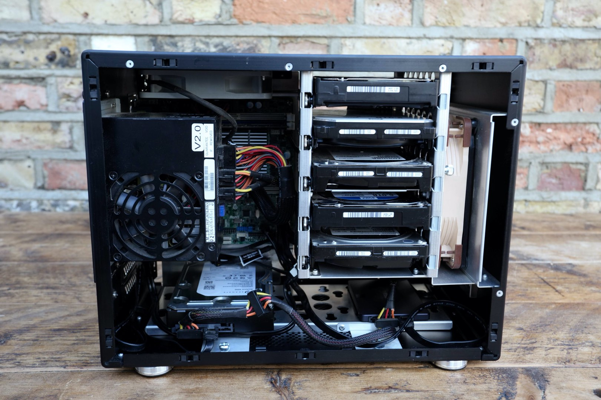
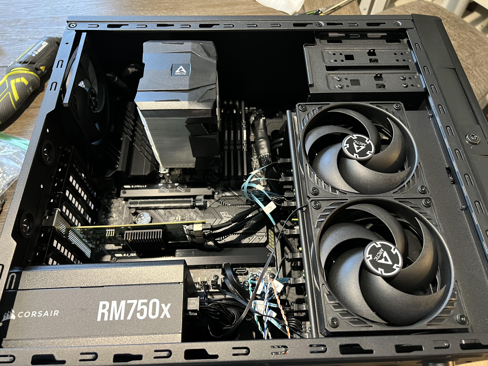

# Cases

The perfect case doesn't exist. But here are some options that might do the trick (there are affiliate links to some of them) in your next server build.

!!! success "Contribute your mini case review!"
    Help us make this page into the best case review page for media server enthusiasts around. 
    
    Submit a PR with your mini case review (250 word max), even link to your own personal blog if you like for the full review. Include at least one picture of the case and follow the format defined in the [Lian-Li PC-Q25B](#lian-li-pc-q25b) section.

## Lian-Li PC-Q25B

> Review contributed by [ironicbadger](https://github.com/ironicbadger)

The Lian-Li PC-Q25B was released in 2011 and is unfortunately no longer in production so far as I can tell. You can find the odd used model popping up on eBay. It supports 5 hot swap 3.5" drives and has space for 2 more non hot swap 3.5" drives in the bottom.

* Motherboard Form Factor - Mini-ITX
* PSU Form Factor - SFX
* Number of 3.5" drive bays - 7 (5 hot swap)
* Dimensions - 7.8 x 11 x 14.4" / 199 x 280 x 366 mm
* Pricing - Avg used sale price on [eBay](https://www.ebay.com/sch/i.html?_from=R40&_nkw=lian+li+pc-q25b&_sacat=0&rt=nc&LH_Sold=1&LH_Complete=1) $55-100

This case was popular in the [unRAID compulsive design](https://www.google.com/search?q=lian+li+pc+q25b+site:forums.unraid.net&sxsrf=ALeKk010EUCoKTRzD-kvP21muTqzIAtB5w:1609223374686&sa=X&ved=2ahUKEwjc0fKcyPLtAhWIq1kKHSnfCPEQrQIoBHoECAcQBQ&biw=1532&bih=1158) forum and several users posted successful builds if you're after an idea of how the finished product will look.

The above picture is my own personal build from when I lived in a tiny apartment in London and space was at a premium. The diminuitive size of this case made it perfect for apartment living. Sporting only 2 fans (1 120mm and 120/140mm) it was quiet and had a small, but sufficient, amount of airflow meaning that temps were never an issue. 

The build pictured made use of an [ASrock Rack C2750D4I](https://www.asrockrack.com/general/productdetail.asp?Model=C2750D4I#Specifications) board which sadly fell victim to the [C2000 Intel bug](http://forum.asrock.com/forum_posts.asp?TID=4376&title=intels-atom-c2000-chips-are-bricking-products) (of death). A shame really because that motherboard was a fantastic level of price to performance for a media server in those days (2016-2018).

## Rosewill LSV4500

...

## Fractal Define Series

### Fractal Define R5

> Review contributed by [ironicbadger](https://github.com/ironicbadger)

The Fractal Define R5 is a classic example of "if it ain't broke, don't fix it". If you've ever seen one of these Define series cases before, then you've already got a fairly good idea of what this case is. A competent, sleek, and understated design, capable of holding 8x 3.5" hard drives and 2x 5.25" drives very comfortably.

<figure markdown>

<figcaption>This is Alex's old server from before he emigrated to the USA. It lives in the UK as his primary off-site <a href="../../04-day-two/backups/">backup</a> system.</figcaption>
</figure>

* Motherboard Form Factor - Mini-ITX, mATX, ATX
* PSU Form Factor - ATX
* Number of 3.5" drive bays - 8
* Dimensions - 23"D x 21.5"W x 13"H
* Pricing - [$125-150](https://amzn.to/47FW8vd)

The case supports motherboards ranging from ITX to ATX in size. There's ample room for cable management with the high quality fit and finish that is a Fractal trademark at this point. The most remarkable thing about this case is how unremarkable it is, and I mean that in a good way. There's almost nothing not to like. It's a thoughtfully laid out and extremely well-built thing.

The drive cages can be reconfigured by adding [additional cages](https://www.reddit.com/r/DataHoarder/comments/kbrjp7/10x8tb_snapraidmergerfs_in_a_fractal_define_r5/) to add more drives in the space in the area directly in front of the PSU. All sorts of 3d printed [mods](https://www.thingiverse.com/thing:2763188) exist for this case due to its long standing popularity.

Fan noise and vibration noise is about as quiet as it gets for a box containing half a dozen hard drives. Rubber grommets on the white drive sleds absorb much of the vibration frequencies and the sound deadened side panels take care of most of the rest.

This is an extreme nitpick but I've always wished Fractal made a backplane for their drive cages. Wiring up 8 individual drives can be a bit of a chore.

Overall, it's an extremely solid option for anyone looking to build a PMS system and will give you space to grow if you're just starting with a couple of drives today.

## Fractal Node Series

> Review contributed by [Hogcycle](https://github.com/hogcycle)

The Fractal Design Node 804 was released in 2014 and is a solid contender for a Perfect Media Server. A major distinction and benefit is how this case is split down the middle into two chambers. 

Beneath an acrylic window lies a shallow, yet adequate space for a micro-ATX based computer. Cooler clearance should not be an issue for flat-face style heatsinks like the Noctua L9 series. Beneath the other side panel is a spacious area with two "rails" that hold cages that hold 4x 3.5" drives each. Two more 3.5 in. drives can be mounted in the floor of the case, for a total of 10 with two 2.5" slots remaining. Vibration is mostly mitigated with rubber dampers on each included screw. Access is easy with large knurled thumbscrews holding the exterior together. 

_Lots of space for drives, even with poor cable management._

* Motherboard Form Factor - Micro-ATX
* PSU Form Factor - ATX
* Number of 3.5" drive bays - 10 (0 hot swap)
* Dimensions - 15.3 x 13.5 x 11.8 " /  388 x 342 x 300  mm (LWH
* Pricing - I purchased mine on promotion for about $80 years back, but they seem to have nearly doubled in price and sit at around $140 new.

While this chassis is larger than other offerings, I chose it for its generous number of 3.5" bays, included quality fans and support for ATX power supplies. Front I/O is adequate, and the blue power LED can simply be unplugged should it cause a disturbance. Included are two fans that are controlled by a built-in 3 position switch. I've always kept it at its lowest and temperature has never been a concern.

## Silverstone CS380

> Review contributed by [glennbrown](http://github.com/glennbrown)

The Silverstone CS380 was released in 2016 and is a great option for a Perfect Media Server. The case offers eight 3.5" hot swap bays plus two additional 5.25" bays.

Inside the case there is ample room for cable management and an included SATA Backplane that uses standard sata connectors and molex plugs. There is room for longer ATX power supplies. There are three included fans however they are loud, I replaced them with Artic P12's. It has clarence for larger tower coolers, pictured is a Arctic Freezer i35. The additional 5.25" bays can provide more drive expansion options.

<figure markdown>

<figcaption>Lots of space and very solidly built case
</figure>

* Motherboard - mITX, mATX & ATX
* PSU Form Factor - ATX
* Number of 3.5" drive bays - 8 Hot Swap with an option for two more with two [Icy Dock Enclosures](https://www.amazon.com/ICY-DOCK-Tray-Less-Enclosure-MB171SP-1B/dp/B0992RQNPB?th=1)
* Dimensions - 8.46"W x 16.77"H x 19.17"D
* Pricing - I purchased mine in 2021 for $164, they are currently selling $230.

I choose this case since it provided me with hot swap bays in a reasonble tower form factor. Overall besides the fan issues I have been extremely happy with this case.